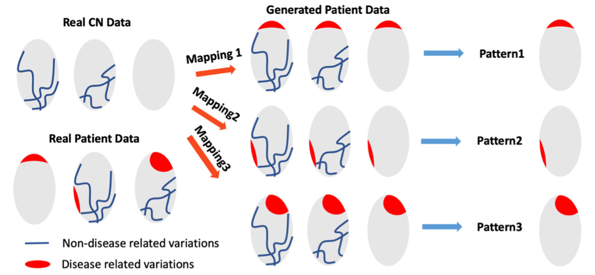

# Smile-GAN
Smile-GAN is a semi-supervised clustering method which is designed to identify disease-related heterogeneity among the patient group. The model effectively avoid variations among normal control (CN) group and cluster patient based on disease related variations only. Semi-supervised clustering of Smile-GAN is achieved through joint training of the mapping and clustering function, where the mapping function can map CN subjects along different mapping directions depending on disease-related variations.



## License
Copyright (c) 2016 University of Pennsylvania. All rights reserved. See[ https://www.cbica.upenn.edu/sbia/software/license.html](https://www.cbica.upenn.edu/sbia/software/license.html)

## Installation
We highly recommend the users to install **Anaconda3** on your machine. After installing Anaconda3, Smile-GAN can be used following this procedure:

We recommend the users to use the Conda virtual environment:

```bash
$ conda create --name smilegan python=3.8
```
Activate the virtual environment

```bash
$ conda activate smilegan
```

Install other SmileGAN package dependencies (go to the root folder of SmileGAN)

```bash
$ ./install_requirements.sh
```

Finally, we need to install SmileGAN from PyPi:

```bash
$ pip install SmileGAN
```


## Input structure
Main functions of SmileGAN basically takes two panda dataframes as data inputs, **data** and **covariate** (optional). Columns with name *'participant_id'* and *diagnosis* must exist in both dataframes. Some conventions for the group label/diagnosis: -1 represents healthy control (CN) and 1 represents patient (PT); categorical variables, such as sex, should be encoded to numbers: Female for 0 and Male for 1, for example. 

Example for **data**:

```bash
participant_id    diagnosis    ROI1    ROI2 ...
subject-1	    -1         325.4   603.4
subject-2            1         260.5   580.3
subject-3           -1         326.5   623.4
subject-4            1         301.7   590.5
subject-5            1	       293.1   595.1
subject-6            1         287.8   608.9
```
Example for **covariate**

```bash
participant_id    diagnosis    age    sex ...
subject-1	    -1         57.3   0
subject-2 	     1         43.5   1
subject-3           -1         53.8   1
subject-4            1         56.0   0
subject-5            1	       60.0   1
subject-6            1         62.5   0
```

## Example
We offer a toy dataset in the folder of SmileGAN/dataset.

**Runing SmileGAN for clustering CN vs Subtype1 vs Subtype2 vs ...**

```bash
import pandas as pd
from SmileGAN.Smile_GAN_clustering import single_model_clustering, cross_validated_clustering, clustering_result

train_data = pd.read_csv('train_roi.csv')
covariate = pd.read_csv('train_cov.csv')

output_dir = "PATH_OUTPUT_DIR"
ncluster = 3
start_saving_epoch = 6000
max_epoch = 10000

## three parameters for stopping threhold
WD = 0.11
AQ = 20
cluster_loss = 0.0015
```

When using the package, ***WD***, ***AQ***, ***cluster\_loss*** need to be chosen empirically. WD is recommended to be a value between 0.1-0.15, AQ is recommended to be 1/20 of patient numbers and cluster\_loss is recommended to be a value between 0.0015-0.002. A large value of ***start\_saving\_epoch*** can better guarantee the convergence of the model though requires longer training time.


```bash
single_model_clustering(train_data, ncluster, start_saving_epoch, max_epoch,\
					    output_dir, WD, AQ, cluster_loss, covariate=covariate)
```
**single\_model\_clustering** performs clustering without cross validation. Since only one model is trained with this function, the model may be not representative or reproducible. Therefore, this function is ***not recommended***. The function automatically saves an csv file with clustering results and returns the same dataframe.


```bash				    
fold_number = 10  # number of folds the leave-out cv runs
data_fraction = 0.8 # fraction of data used in each fold
cross_validated_clustering(train_data, ncluster, start_saving_epoch, max_epoch,\
					    output_dir, WD, AQ, cluster_loss, covariate=covariate)
```

**cross\_validated\_clustering** performs clustering with leave-out cross validation. It is the ***recommended*** function for clustering. Since the CV process may take long training time on a normal desktop computer, the function enables early stop and later resumption. Users can set ***stop\_fold*** to be early stopping point and ***start\_fold*** depending on previous stopping point. The function automatically saves an csv file with clustering results and returns the same dataframe.

```					    
model_dirs = ['PATH_TO_CHECKPOINT1','PATH_TO_CHECKPOINT2',...] #list of paths to previously saved checkpoints (with name 'coverged_model_foldk' after cv process)
cluster_label, cluster_probabilities = clustering_result(model_dirs, ncluster, 'highest_matching_clustering, train_data, covariate)
```
**clustering\_result** is a function used for clustering patient data using previously saved models. Input data and covariate (optional) should be panda dataframe with same format shown before. Exactly same CN data used for training should be included while PT data can be any samples inside or outside of the training set. ***The function returns cluster labels of PT data following the order of PT in the provided dataframe.*** If ***consensus\_type*** is chosen to be ***'highest\_matching\_clustering***, probabilities of each cluster will also be returned. 


## Citation
If you use this package for research, please cite the following papers:

```bash
@misc{yang2020smilegans,
      title={Smile-GANs: Semi-supervised clustering via GANs for dissecting brain disease heterogeneity from medical images}, 
      author={Zhijian Yang and Junhao Wen and Christos Davatzikos},
      year={2020},
      eprint={2006.15255},
      archivePrefix={arXiv},
      primaryClass={q-bio.QM}
}
```

```bash
@misc{yang2021BrainHeterogeneity,
      title={Disentangling brain heterogeneity via semi-supervised deep-learning and MRI: dimensional representations of Alzheimer's Disease}, 
      author={Zhijian Yang and Ilya M. Nasrallah and Haochang Shou and Junhao Wen and Jimit Doshi and Mohamad Habes and Guray Erus and Ahmed Abdulkadir and Susan M. Resnick and David Wolk and Christos Davatzikos},
      year={2021},
      eprint={2102.12582},
      archivePrefix={arXiv},
      primaryClass={cs.LG}
}
```


